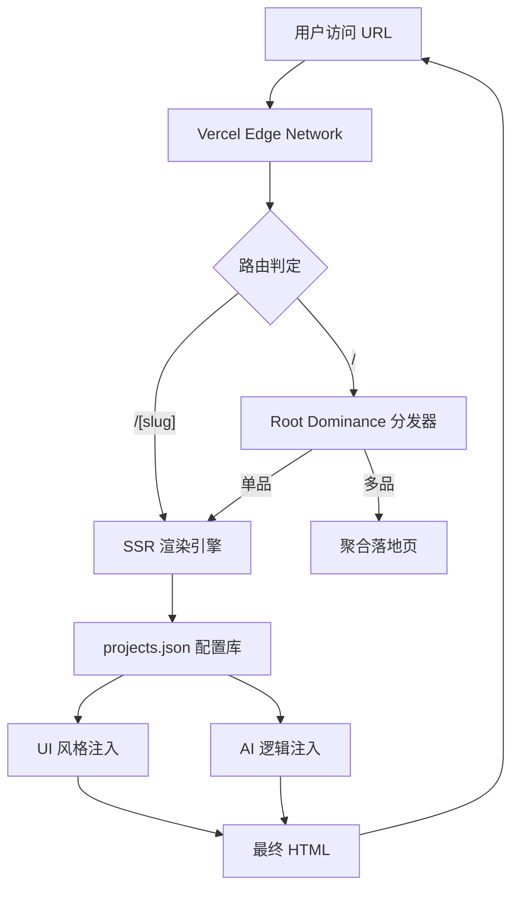

# 🏗️ 动态架构协议 (Dynamic Architecture Protocol)

本协议定义了 **Universal-Harvest-Template** 的核心驱动引擎。我们不再为每个产品单独编写代码，而是通过 **配置驱动 (Configuration Driven)** 实现“无限裂变”。

---

## 1. 动态映射 (Dynamic Mapping)

### 核心原理
**"One Codebase, Infinite Faces."**
物理上，整个项目只维护一个核心页面文件：`src/app/[slug]/page.tsx`。

### 运作机制
当用户访问 `/avatar-oracle` 或 `/dream-interpreter` 时：
1.  **路由捕获**：Next.js 捕获 URL 中的 `slug` 参数。
2.  **配置抓取**：系统自动读取 `config/projects.json`。
3.  **实时渲染**：根据 JSON 配置，动态注入：
    *   **UI 风格** (`style`): 控制 CSS 变量（如 `black_gold_77`, `acid_aesthetic`）。
    *   **文案内容** (`description`, `features`): 替换页面文本。
    *   **逻辑参数** (`prompt_template`): 调整 AI 的行为模式。

### 优势
*   **零代码上新**：新增一个产品只需在 JSON 中添加几行配置。
*   **全局统一**：修改一处代码，所有产品同时受益（如修复 Paywall Bug）。

---

## 2. 根目录旗舰化 (Root Dominance)

### 核心原理
**"No Dead Landing Pages."**
根目录 `/` 不应是一个死板的导航页，它必须是流量的**动态分发器**。

### 运作机制
在 `src/app/[locale]/page.tsx` 中实现智能分发逻辑：
1.  **环境驱动**：通过 `NEXT_PUBLIC_CURRENT_TOOL` 指定当前主推项目，访问 `/` **自动静默重定向** 至该项目。
2.  **多品模式**：如果未指定环境变量，`/` 保持为默认入口，避免空页与 404。
3.  **AB 测试**：可根据流量来源（Referer）动态决定跳转到哪个工具（如 TikTok 流量 -> 占卜，LinkedIn 流量 -> 简历优化）。

---

## 3. 实时拼装 (SSR - Server Side Rendering)

### 核心原理
**"Just-in-Time Assembly."**
彻底放弃静态网页生成 (SSG)，全面拥抱 Vercel 的 **Edge/Serverless SSR**。

### 技术实现
*   **Force Dynamic**: 所有页面强制开启 `export const dynamic = 'force-dynamic'`。
*   **毫秒级构建**：用户点击链接的瞬间，Vercel 服务器在边缘节点执行以下操作：
    1.  解析 URL。
    2.  读取最新配置。
    3.  拼装 HTML + CSS。
    4.  流式返回给用户。

### 商业价值 (PSEO)
*   **海量页面**：我们可以生成 10,000 个不同的 URL（如 `/dream-of-snake`, `/dream-of-flying`），每个页面拥有独立的 SEO 标题和元数据，但背后运行的是同一套代码逻辑。
*   **秒级部署**：无需等待漫长的 Build 过程，配置修改立即生效。

---

## 4. 架构图示

